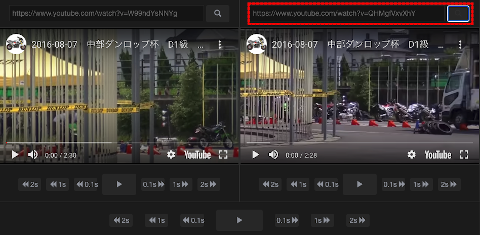
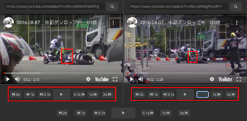
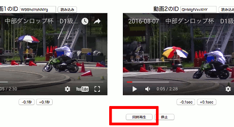

1. 動画1の読み込み  
左側の「Youtubeアドレス入力欄」に動画URLを貼り付けてください。  
「虫眼鏡ボタン」をクリックすると動画が表示されます。  
(一瞬だけ再生して一時停止状態になります) 

２. 動画2の読み込み  
右側も同じようにして動画を読み込んでください。  

3. 動画の再生位置の調整  
動画の下にある「前後コマ送りボタン」で再生位置を調整して、2つの動画の基準位置を合わせます。  
(この例では、スタート直後のパイロンを通過する瞬間に合わせてみました)  

4. 同時再生  
位置合わせが完了したら、画面下部中央の「同時再生ボタン」を押してください。  
2つの動画が同時に再生開始されます。  

  
※YoutubePlayerのラグで再生開始が微妙にズレてしまう事もあります。  
その時は一時停止停止して3)の調整を再度行ってください。  
  
※以下のサンプルのように、URLに動画IDを埋め込むこともできます  
hikaku/?v1=W99hdYsNNYg&v2=QHMgfVxvXhY  
パラメータ説明  
v1/v2 動画ID  
v1o/v2o 動画再生開始位置  
