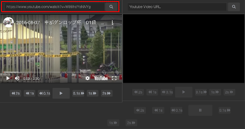
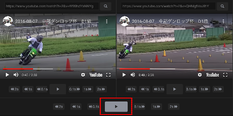

1. 動画1の読み込み  
左側の「Youtubeアドレス入力欄」に動画URLを貼り付けてください。  
「虫眼鏡ボタン」をクリックすると動画が表示されます。  
(一瞬だけ再生して一時停止状態になります) 

２. 動画2の読み込み  
右側も同じようにして動画を読み込んでください。  

3. 動画の再生位置の調整  
動画の下にある「前後コマ送りボタン」で再生位置を調整して、2つの動画の基準位置を合わせます。  
(この例では、スタート直後のパイロンを通過する瞬間に合わせてみました)  

4. 同時再生  
位置合わせが完了したら、画面下部中央の「同時再生ボタン」を押してください。  
2つの動画が同時に再生開始されます。  
  
  
上記の例では同一コースの第１ヒートと第２ヒートを比較しました。  
同じセクションですが走行ラインが異なっている事がわかります。  
  
tips1  
YoutubePlayerのラグで再生開始が微妙にズレてしまう事もあります。  
その時は一時停止停止して3)の調整を再度行ってください。  
  
tips2  
以下のサンプルのように、URLに動画IDを埋め込むこともできます。
[https://www.riders.ws/hikaku/?v1=W99hdYsNNYg&v2=QHMgfVxvXhY&v1o=2.62&v2o=2.29](https://www.riders.ws/hikaku/?v1=W99hdYsNNYg&v2=QHMgfVxvXhY&v1o=2.62&v2o=2.29)  
※パラメータ付きリンクからページを開いた時は、手動で再生ボタンを押下する必要があります。

パラメータ説明  
| パラメータ | 用途 |
----|---- 
| v1 | 動画１のID |
| v2 | 動画２のID |
| v1o | 動画１の再生開始位置 |
| v2o | 動画２の再生開始位置 |
